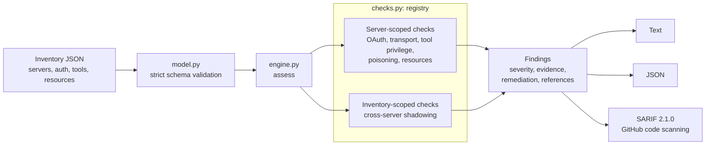

# mcp-audit

[](https://github.com/achandra-security/mcp-audit/actions/workflows/ci.yml)

**Offline security assessment for Model Context Protocol (MCP) server deployments.**

mcp-audit reads a JSON inventory of MCP servers, covering how each one is exposed, how it authorizes callers, which tools it declares with which scopes, and which resources it serves. It reports structured findings with severity, evidence, remediation, and standards references. It is written for the security review that should happen before an MCP server is connected to an agent: checking the OAuth resource-server configuration, tool privilege, tool-metadata integrity, and approval gates.

The assessment engine is **offline and non-destructive by design**. It never connects to a server, so it is safe to run in CI against configuration you do not yet trust. All sample configurations are synthetic.

## Five-minute tour

```bash
git clone https://github.com/achandra-security/mcp-audit && cd mcp-audit
python -m pip install -e ".[dev]"
mcp-audit scan configs/poisoned_tools.json
```

```text
configs/poisoned_tools.json: 4 finding(s) (critical=1, high=3)

  [CRITICAL] MCP-010 Tool description contains prompt-injection indicators (tool poisoning)
    server:      weather
    target:      tool:get_forecast
    evidence:    pseudo-system tag; concealment from user; reference to credentials or secrets;
                 pre-emptive instruction to the model; invisible characters ['U+200B']
    remediation: Treat tool descriptions as untrusted input. Pin and review them, show users what the
                 model sees, and alert when a description changes after approval (rug pull).

  [HIGH] MCP-011 Tool shadowing across servers
    server:      mail, weather
    target:      tool:Send-Email
    evidence:    name collides after normalization across servers ['mail', 'weather']: ['Send-Email', 'send_email']
  ...
```

Full reports are in [`examples/`](examples/). The deliberately misconfigured `configs/insecure_proxy.json` produces 21 findings, and `configs/hardened.json` produces none.

## Checks

| ID | Default severity | What it looks for |
|---|---|---|
| MCP-001 | high | Tool scopes that are wildcards or admin-level (`*`, `crm:*`, `admin`, `full_access`) |
| MCP-002 | high | Tool marked `readOnlyHint`, or named like a read (`get_`, `list_`, `search_`), that holds write-capable scopes |
| MCP-003 | critical / medium | Remote server with no authorization (critical) or a long-lived static token (medium) |
| MCP-004 | high | Issuer (`iss`) not validated, not HTTPS, or different from the expected issuer |
| MCP-005 | critical / high | Audience (`aud`) not validated or wildcarded (critical); server URI missing from accepted audiences, or other hosts accepted (high) |
| MCP-006 | high | PKCE not required, or `plain` allowed instead of S256 only |
| MCP-007 | critical | Inbound access token forwarded to downstream APIs (token pass-through); remediation points to RFC 8693 token exchange |
| MCP-008 | medium | RFC 8707 resource indicators not required |
| MCP-009 | high | Confused-deputy setup: a proxy with a static client ID at a third-party AS, dynamic client registration, and no per-client consent |
| MCP-010 | high / critical | Tool poisoning indicators in descriptions: instruction overrides, pseudo-system tags, concealment, secret paths, exfiltration URLs, invisible characters, oversized text |
| MCP-011 | high | Tool shadowing: confusable tool names across servers, or descriptions that try to steer another server's tool |
| MCP-012 | high / critical | Destructive tool (by annotation or verb) without a required human approval; critical when it also has wildcard scope |
| MCP-013 | low / medium | Missing tool annotations, or a destructive-named tool annotated `destructiveHint: false` |
| MCP-014 | high / critical | Resources outside allowed roots, `..` traversal, or an allowed root that is the whole filesystem |
| MCP-015 | high | Remote endpoint not served over HTTPS (localhost excepted) |
| MCP-016 | medium | Proxy uses one static downstream credential for all users |

Each finding cites its basis. That can be the MCP specification (2025-06-18 revision, Authorization and Security Best Practices), RFC 7636 (PKCE), RFC 8693 (Token Exchange), RFC 8707 (Resource Indicators), RFC 9068 (JWT access tokens), RFC 9700 (OAuth 2.0 Security BCP), or the OWASP Top 10 for LLM Applications (2025).

## Architecture



Checks are plain functions registered with a decorator. Adding one takes about 15 lines. See [`docs/architecture.md`](docs/architecture.md) for the design and for how to add a check. The input format is documented in [`docs/config-schema.md`](docs/config-schema.md).

## Usage

```bash
mcp-audit scan configs/*.json                         # text report
mcp-audit scan inventory.json --format json
mcp-audit scan inventory.json --format sarif > mcp-audit.sarif
mcp-audit scan inventory.json --min-severity high
mcp-audit scan inventory.json --only MCP-005 --only MCP-007
mcp-audit scan inventory.json --fail-on high          # exit 2 for CI gating
mcp-audit checks
```

To gate a pull request that changes MCP configuration, run `mcp-audit scan --format sarif` in a workflow and upload the file with `github/codeql-action/upload-sarif`. Findings then appear as code-scanning alerts.

## Tests

```bash
python -m pytest -v
```

The tests cover positive and negative cases for every check, severity escalation, the `--only` and `--skip` options, schema validation errors, the three sample configurations, and the text, JSON, and SARIF outputs. CI runs the suite on Python 3.10, 3.11, and 3.12, and fails if the hardened configuration produces any finding.

## Security assumptions and limitations

- **It assesses declared configuration, not runtime behavior.** A server that validates audiences in its config file but not in its code will pass. Use this as a design and configuration review, alongside testing.
- **The inventory format belongs to this project.** You describe your deployment in it. There is no importer yet for any specific MCP host's configuration file.
- **Tool poisoning detection is pattern-based.** It catches common, known phrasings and hidden characters. It will miss novel or obfuscated injections, so treat a clean MCP-010 result as "no known indicators", not "safe".
- **Destructive-tool detection uses annotations and verb heuristics.** Annotations are server-supplied hints and can be wrong or malicious. Verify real blast radius from the credential the tool uses.
- **There are no live protocol checks.** mcp-audit does not fetch OAuth metadata, attempt token replay, or call tools. Live checks are on the roadmap. They would require explicit authorization and would be limited to non-destructive requests.

## Roadmap (not implemented)

- Importers for common MCP host configuration formats
- Optional, explicitly authorized live checks: fetching protected resource metadata (RFC 9728) and authorization server metadata (RFC 8414), then comparing them with the declared configuration
- Tool-description pinning, with diffing between scans to detect rug-pull changes
- Policy-as-code overrides for per-organization severity and allowed scopes

## Scope note

This is a new reference implementation. It makes no claims about vulnerabilities in any specific MCP server product, and it does not include any vulnerability disclosures or CVE data.

## License

MIT. This is original code written as a public reference implementation. It contains no employer code, configurations, or data.
