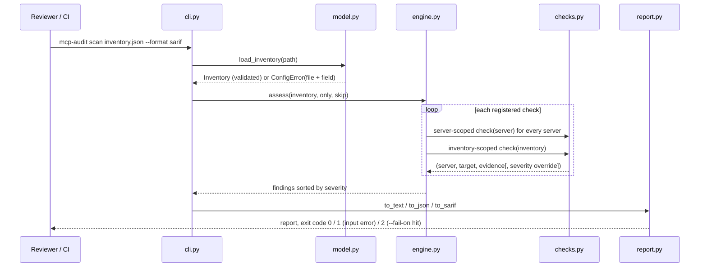
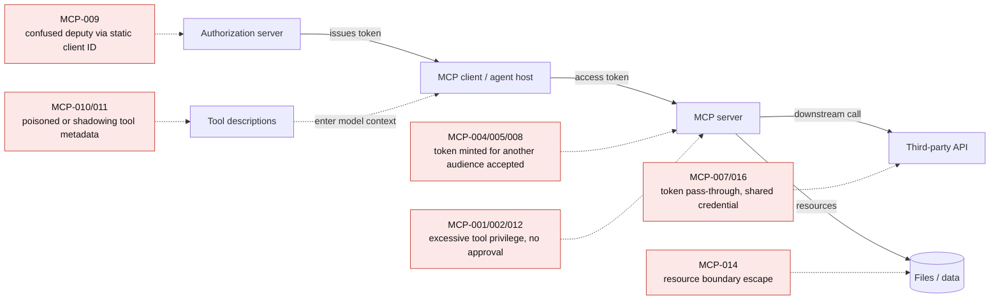

# Architecture

## Why offline first

MCP servers are often third-party code with broad credentials. The first review question is not "can I exploit it?". It is "should this be connected at all, and with what configuration?" An offline engine can:

- run in CI on every configuration change, with no network access and no credentials;
- be pointed safely at servers you have not yet vetted;
- produce deterministic, diffable results that suit review gates.

## Flow



## Threat model covered



## OAuth checks and the standards behind them

| Concern | Expected configuration | Standard |
|---|---|---|
| Token audience | Accept only tokens whose `aud` is this server's canonical URI | MCP Authorization; RFC 8707; RFC 9068 |
| Token issuer | Validate `iss` against one configured HTTPS issuer | RFC 9068; RFC 9700 |
| Code interception | PKCE required, S256 only | RFC 7636; RFC 9700 |
| Downstream calls | Exchange the inbound token for a downstream-audience token instead of forwarding it | MCP Security Best Practices; RFC 8693 |
| Audience binding at issuance | Clients send `resource`, and the AS mints audience-restricted tokens | RFC 8707 |
| Proxy consent | Per-client consent when a proxy uses a static client ID upstream | MCP Security Best Practices (confused deputy) |

## Adding a check

```python
from mcp_audit.checks import check, MCP_TOOLS

@check("MCP-100", "Tool accepts free-form shell input", "high",
       "Constrain inputs with an enum or pattern; never pass model output to a shell.", (MCP_TOOLS,))
def shell_tools(server):
    for tool in server.tools:
        if "shell" in tool.name or "command" in tool.description.lower():
            yield server.name, f"tool:{tool.name}", "tool appears to execute commands"
```

Yield `(server, target, evidence)`, or add a fourth element to override the severity for that instance. Add positive and negative tests in `tests/test_checks.py`.
